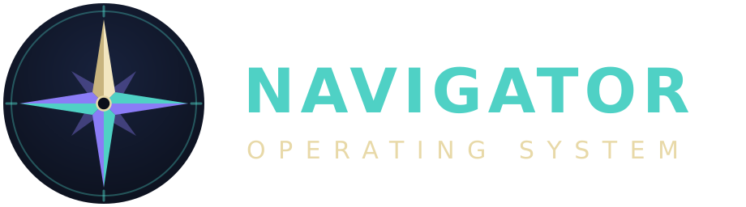

<p align="center">
  
</p>

# Introducing Navigator OS

**An AI-native Linux desktop, built in the open — and built so that every
claim about it can be checked.**

Most "AI desktops" bolt a chat window onto an existing system. Navigator
starts from a different question: if the assistant could actually *see* the
machine — the hardware, the filesystem, the windows on screen — and could
decide for itself when a local model is enough and when it isn't, what would
the desktop look like?

Navigator is the attempt to answer that. It is a Fedora Atomic image with
Hyprland, a custom Quickshell desktop, and a six-module AI stack wired into
the system rather than sitting on top of it.

---

## What it actually does today

You press Super+Space. A panel opens. You ask "how many CPU cores does this
machine have?"

What happens next is the whole project in miniature:

1. The **router** decides where the request should go. It looks at the
   hardware tier, whether a local model is loaded, your preference
   (privacy / cost / speed / balanced), and whether the request smells like it
   needs tools.
2. If it goes local, **Ollama** answers on your machine and nothing leaves it.
   If the request is too much for the local model, it goes to the **cloud**
   with your own API key — never a key baked into the image.
3. Either way, the model doesn't guess. It calls a real tool over **MCP** and
   answers from real data: `hardware_tier`, `list_windows`,
   `read_file`, `list_workspaces`.

The desktop is a custom shell, not a theme on someone else's. The workspace
indicator is bound to Hyprland's event socket, so it updates from compositor
events rather than polling. The assistant panel really shells out to the
router; the wallpaper, the palette and the compositor config all ship in the
image.

## What it does *not* do yet

This section exists on purpose, and it is not a footnote.

- **No model weights ship in the image.** The Ollama runtime does, but which
  model belongs on your machine is your call — and a model is another ~2 GB.
  Until you run `ollama pull`, the assistant falls through to the cloud,
  which needs your key.
- **There is no icon or cursor theme yet.** The GTK and Qt widget colours are
  real and verified against the palette, but icons and cursors are Adwaita's —
  those are drawn assets, not a colour mapping, so they are a different kind of
  work.
- **The small local model is not fully reliable at tool use.** A 3B model
  occasionally calls a tool it doesn't need, or emits tool-call-shaped JSON as
  prose. This is documented, measured, and mitigated — not hidden.
- **This is not a daily driver.** Try it in a VM.

## The part that might actually be worth your time

Navigator has one strong convention, and it is the reason the project exists
in its current shape:

> **Nothing is presented as working unless it was measured.**

Every module README cites the CI run that proves its claims. Limitations are
recorded in the same paragraph as the successes. And two habits fall out of
that rule which have repeatedly earned their keep:

**Measure first, assert second.** When a behaviour isn't a documented
guarantee, it goes into CI as a *diagnostic that cannot fail the job*. Only
once the real number is known does it become an assertion. The mistake this
project has made most often is writing the assertion first, from memory — and
it has cost real CI rounds every time.

**Prove the check isn't vacuously green.** A test that passes tells you very
little until you've seen it fail on purpose. Navigator's boot test
deliberately breaks the compositor config mid-run, confirms the error check
speaks up, then reverts and re-checks.

That second habit caught something worth telling you about.

### The screenshot that paid for itself

For a long time every Navigator test was textual: `hyprctl` output, IPC
responses, process states. Everything was green. Then the boot test started
capturing an actual picture of the screen — via QEMU's own HMP monitor, so no
VNC client and nothing running inside the guest.

The very first screenshot found two problems that had silently passed every
textual test:

1. A **red config-error banner** sitting across the top of the desktop.
   Hyprland 0.51 had removed `gestures:workspace_swipe` and the config still
   used it. Three separate checks had missed it — including one that was
   *actively printing "(none)"* while the error was on screen.
2. The desktop was still showing the **stock Hyprland wallpaper**. Navigator
   had no wallpaper of its own. No textual test could ever have seen that.

The lesson generalises, and it is now written into the repository: if a
component's output is visual, a silent textual check is not evidence that it
works.

The fix for the wallpaper had a second lesson in it. The first version of the
check asked "is the desktop dark?" — and collapsed the moment the real brand
image arrived, because a bright wave through its middle put its brightness
next to the stock wallpaper's. Brightness was measuring a *summary*, not an
*identity*. It was replaced with a block-wise comparison against the reference
image, with a threshold derived from three real measurements rather than
taste.

## Architecture, briefly

| Layer | Choice |
|---|---|
| Base | Fedora Atomic (OSTree, immutable, `bootc`) |
| Compositor | Hyprland (Wayland), from our own COPR |
| Shell | Quickshell (Qt6/QML), written for Navigator |
| AI stack | hardware-probe · local-runtime · mcp-tools · router · cloud-bridge · assistant |
| Theme | Brand palette, wallpaper, compass identity |

The six AI modules are **stdlib-only** — no third-party Python dependencies at
all, which is why the image layer needs no pip and no venv. They talk to each
other as subprocesses over a flat sibling hierarchy, and that hierarchy is a
runtime contract: rename a directory and the chain breaks silently. It did,
once, in CI. Now it's asserted.

Hyprland comes from `denorath/navigator-hyprland` because the widely used
third-party COPR had *copied* its Fedora 43 binaries into the Fedora 44 chroot
instead of rebuilding them — so aquamarine still wanted a `libdisplay-info`
that F44 no longer ships. Diagnosing that took a while; the fix was 13
packages genuinely rebuilt, plus one source patch for a C++ standard-library
rename that landed with GCC 16.

## Trying it

In a VM, from a real CI-built disk image:

```
# grab the qcow2 from the latest "Build Disk Image & Boot Test" run artifact,
# then boot it with UEFI (OVMF) firmware
```

On an existing Fedora Atomic system:

```sh
sudo bootc switch ghcr.io/denorath-sys/navigator:latest
sudo systemctl reboot
```

`sudo bootc rollback` puts you back. The immutable base means that is lossless.

To run a model locally, pull one — the runtime is already there and running:

```sh
ollama pull llama3.2:3b   # what hardware-probe recommends for a "low" tier
```

Until you do, `model_ready` stays false and the router routes to the cloud.

To give the assistant cloud access, put your own key in
`~/.config/navigator/env` — the file ships as an empty, commented template and
image updates never overwrite it. It is ignored unless it is `chmod 600`, on
purpose: silently reading a world-readable API key would mean you never find
out it was exposed.

## Where it's going

Phase 5 is real-hardware installation testing and a first community release.
Before that: building the GTK/Qt theme assets, and adding real input injection
to the visual test so clicks can be verified, not just rendering. Layering
Ollama in is done — the runtime ships in the image; the weights are still
yours to choose.

## Contributing

It's a one-person hobby project. Documentation and code are in English;
commit messages before August 2026 are in Turkish, which is why the history
reads bilingually — it was deliberately not rewritten, so the commit SHAs
cited throughout the docs stay valid.

One rule matters more than the rest: **no claim lands without a measurement
behind it.** If you say something works, include the test or the CI run link.
Writing "not measured" is entirely acceptable — it's how most of this
repository got written.

---

**Repository:** <https://github.com/denorath-sys/navigator> · **License:** GPL-3.0
